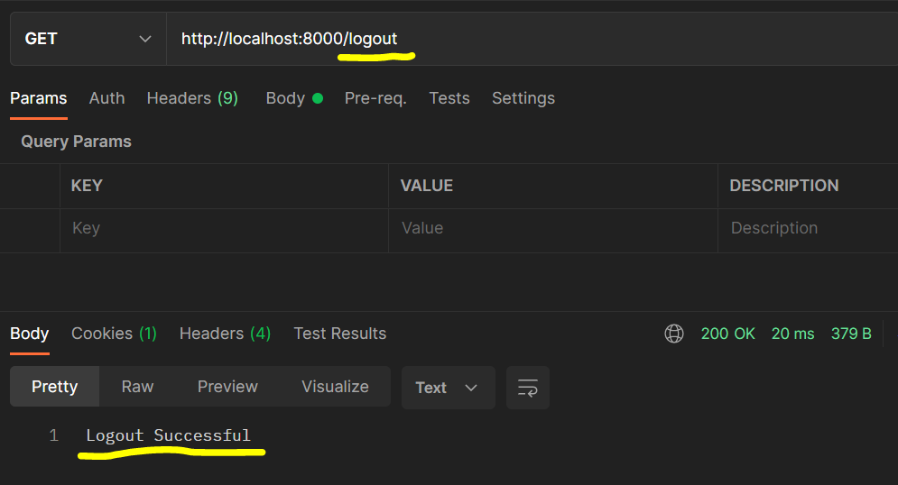

## How authentication works

A client sends the authentication request to the server with the credentials. The server validates the credentials with the database entry. If the match is successful, it writes something called **cookie** in the response.
This **cookie** will be sent back from the client in the subsequent requests to the server which is used by the servers to validate if the cookie attached is valid (on the basis of the one sent in the first place).

### Sessions

A **session** is a way to record users authentication related payload in a cookie over a period of time.

Here's a diagram from book `Handson restful services with Go`:


When the user **logs in** in by sending valid credentials, the server attaches the cookie in the response. Then the client uses that cookie (saved in the browser or client service) to make future requests.
When a client makes a **logout** request by sending a API on the server, the server destroys the session in the response. The server can also place an expiration on cookies so that the session expires after a certain time if there is no activity.

Let us use `gorilla/mux` package to implement this workflow.

We will use the packages:

- "github.com/gorilla/mux"
- "github.com/gorilla/sessions"

Let us create a cookie store first from the sessions package

```Go
// store the secret key in env variable in production
var store = sessions.NewCookieStore([]byte("my_secret_key"))
```

This secret key is supposed to be a secret for the server. The cookie session is encrypted and decrypted using this key. This is how the server validates if the user/client is logged in with proper payload on the cookie or not.

First we will create three routes to implement the authentication example:

- /login
- /logout
- /healthcheck (a test route that will be used by the logged in user)

Lets create the login handler. I will add relevant comments for code explanation:

```Go
func loginHandler(w http.ResponseWriter, r *http.Request) {
	if r.Method != "POST" {
		http.Error(w, "Method Not Supported", http.StatusMethodNotAllowed)
		return
	}
	// ParseForm parses the raw query from the URL and updates r.Form
	err := r.ParseForm()
	if err != nil {
		http.Error(w, "Please pass the data as URL form encoded", http.StatusBadRequest)
		return
	}

  // Get username and password from the parsed form
	username := r.Form.Get("username")
	password := r.Form.Get("password")

	// Check if user exists
	storedPassword, exists := users[username]
	if exists {
		// It returns a new session if the sessions doesn't exist
		session, _ := store.Get(r, "session.id")
		if storedPassword == password {
			session.Values["authenticated"] = true
			// Saves all sessions used during the current request
			session.Save(r, w)
		} else {
			http.Error(w, "Invalid Credentials", http.StatusUnauthorized)
		}
		w.Write([]byte("Login successfully!"))
	}

}
```

Now let us create the logout handler which will cater to the `GET` request. In this handler we will set the `authenticated` flag on the request session to `false`

```Go
func logoutHandler(w http.ResponseWriter, r *http.Request) {
	// Get registers and returns a session for the given name and session store.
	session, _ := store.Get(r, "session.id")
	// Set the authenticated value on the session to false
	session.Values["authenticated"] = false
	session.Save(r, w)
	w.Write([]byte("Logout Successful"))
}
```

Now let us implement the test handler which is serving the `protected route : /healthcheck`:

```Go
func healthcheck(w http.ResponseWriter, r *http.Request) {
	session, _ := store.Get(r, "session.id")
	authenticated := session.Values["authenticated"]
	if authenticated != nil && authenticated != false {
		w.Write([]byte("Welcome!"))
		return
	} else {
		http.Error(w, "Forbidden", http.StatusForbidden)
    return
	}
}
```

Now let us use the `gorilla/mux` library to hook up all the handlers in our main function:

```Go
func main() {
  r := mux.NewRouter()
	r.HandleFunc("/login", loginHandler).Methods("POST")
	r.HandleFunc("/logout", logoutHandler).Methods("GET")
	r.HandleFunc("/healthcheck", healthcheck).Methods("GET")
	// modifying default http import struct to add an extra property
	// of timeout (good practice)
	httpServer := &http.Server{
		Handler: r,
		Addr: "127.0.0.1:8000",
		WriteTimeout: 15 * time.Second,
	}
	log.Fatal(httpServer.ListenAndServe())
}
```

Now let us login with `postman` on the login route and see if we are able to do so:


We can see we are able to login with `200` response and cookies are also set. If we check the cookie set by the server, we will see the name of the cookie is `session'id` which we set from the server side.


Now let us make another request to see if we are able to validate the authenticated user by hitting the protected route `healthcheck`:


Yes, we are!

Now let us hit the `logout` route and see



Yes, we can logout.

Now last thing, let us try to hit the `/healthcheck` again and we should be FORBIDDEN to do so:


And yes, it works! Congratulations, you have successfully created a session based authentication system using Go and Mux package.

In the upcoming blog, we will learn how to make use of `Redis` to persist the user sessions. Till then, stay tuned!
